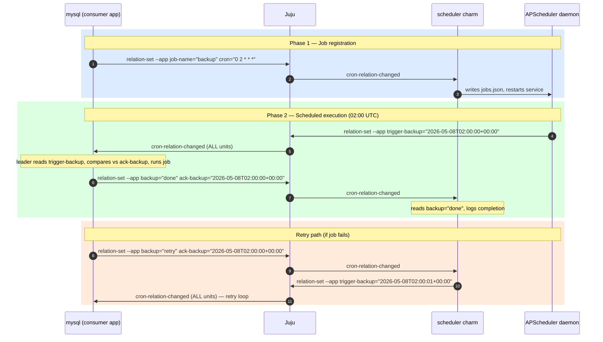

# Scheduler Charm

A Juju machine charm that lets related charms register named cron jobs and
receive a `relation-changed` hook trigger when each job fires. Related charms
implement their own scheduled logic inside that hook.

## How it works

Each cron job is registered as a **separate relation**. One `juju relate` = one job.
Both sides communicate through **application** databags (not unit databags).



## Relation interface: `cron`

The scheduler charm **provides** the `cron` relation (interface: `cron`).

### Scheduler application databag (written by the scheduler)

| Key | Value |
|-----|-------|
| `trigger-<job>` | ISO-8601 UTC timestamp; updated each fire/retry; changing it causes Juju to dispatch `cron-relation-changed` on **all** consumer units |

### Consumer application databag (written by the consuming charm leader)

| Key | Value |
|-----|-------|
| `job-name` | Logical name of the scheduled job (string) |
| `cron` | Standard 5-field cron expression (string) |
| `<job>` | `"done"` \| `"retry"` – the consumer's decision after each trigger |
| `ack-<job>` | The `trigger-<job>` timestamp the consumer is responding to; used to detect which jobs have newly fired |

The scheduler never limits retries. Writing `"retry"` causes the scheduler to
immediately set a new `trigger-<job>` timestamp, re-triggering
`cron-relation-changed`. The consumer decides when to stop retrying by writing
`"done"`.

### Example consuming charm handler

> **One relation = one job.** Each `juju relate` call registers a single named job.
> To schedule multiple jobs, create multiple relations.

```python
import ops


class MyCharm(ops.CharmBase):
    def __init__(self, *args):
        super().__init__(*args)
        self.framework.observe(self.on.cron_relation_joined, self._on_cron_relation_joined)
        self.framework.observe(self.on.cron_relation_changed, self._on_cron_relation_changed)

    def _on_cron_relation_joined(self, event: ops.RelationJoinedEvent) -> None:
        # Write to the APPLICATION databag (leader only writes; Juju handles that).
        # One relation carries exactly one job: set job-name and cron as separate keys.
        if self.unit.is_leader():
            event.relation.data[self.app]["job-name"] = "backup"
            event.relation.data[self.app]["cron"] = "0 2 * * *"  # every day at 02:00 UTC

    def _on_cron_relation_changed(self, event: ops.RelationChangedEvent) -> None:
        # The scheduler writes trigger-<job> to its APPLICATION databag.
        # Writing to the app databag fires relation-changed on ALL consumer units,
        # so guard with is_leader() to act only once.
        if not self.unit.is_leader():
            return

        scheduler_app = event.app  # the remote application (scheduler)
        sched_data = event.relation.data[scheduler_app]
        our_data = event.relation.data[self.app]

        for key, trigger_ts in sched_data.items():
            if not key.startswith("trigger-"):
                continue
            job_name = key[len("trigger-"):]
            ack_key = f"ack-{job_name}"

            if our_data.get(ack_key) == trigger_ts:
                continue  # already processed this trigger

            # This job has newly fired – run it and respond
            try:
                self._run_job(job_name)
                our_data[job_name] = "done"
            except Exception:
                our_data[job_name] = "retry"
            our_data[ack_key] = trigger_ts  # acknowledge this trigger

    def _run_job(self, job_name: str) -> None:
        if job_name == "backup":
            self._do_backup()

    def _do_backup(self): ...
```

## Deployment

```bash
# Build and deploy the scheduler charm
charmcraft pack
juju deploy ./scheduler_ubuntu-22.04-amd64.charm

# Deploy a charm that wants scheduled tasks
juju deploy mysql

# Relate them (same model)
juju relate scheduler mysql

# Cross-model (e.g. scheduler in model-a, mysql in model-b):
juju switch model-a
juju offer scheduler:cron

juju switch model-b
juju consume admin/model-a.scheduler
juju relate scheduler mysql
```

## Configuration

| Option | Default | Description |
|--------|---------|-------------|
| `timezone` | `UTC` | IANA timezone for all cron schedules (e.g. `America/Sao_Paulo`) |

```bash
juju config scheduler timezone=America/Sao_Paulo
```

## Cron expression format

Standard five-field POSIX cron syntax:

```
┌─────────── minute  (0-59)
│ ┌───────── hour    (0-23)
│ │ ┌─────── day of month (1-31)
│ │ │ ┌───── month   (1-12 or JAN-DEC)
│ │ │ │ ┌─── day of week  (0-6 = Sun-Sat, or SUN-SAT)
│ │ │ │ │
* * * * *
```

Examples:

| Expression | Meaning |
|------------|---------|
| `0 2 * * *` | Every day at 02:00 |
| `0 */6 * * *` | Every 6 hours |
| `0 0 * * 0` | Every Sunday midnight |
| `30 4 1 * *` | First of every month at 04:30 |
